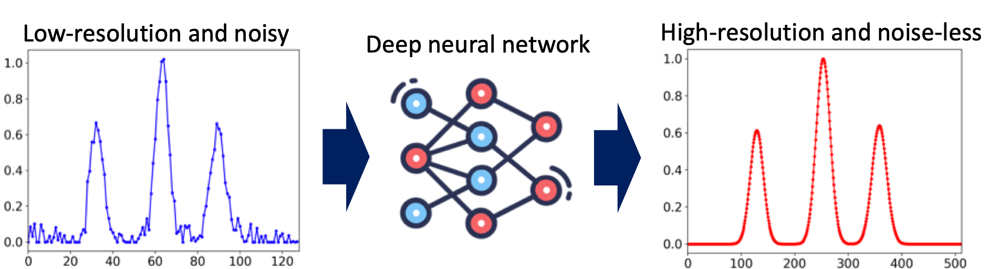
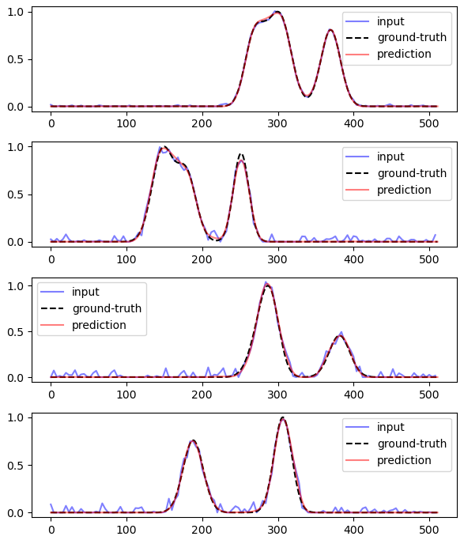
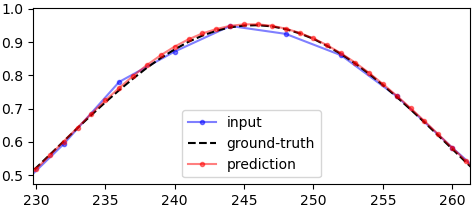
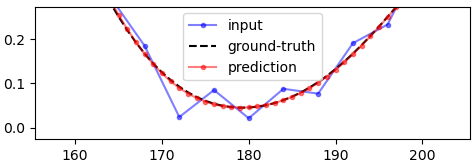
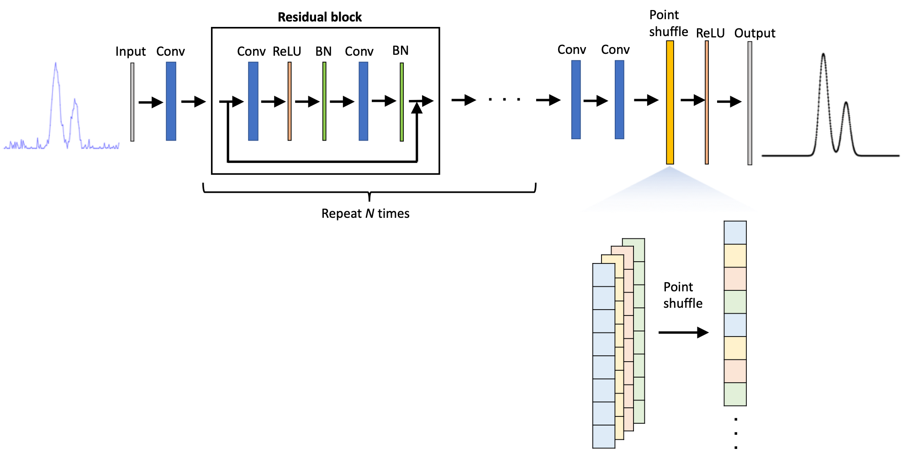

# About this repository  
  

Low-resolution and noisy one-dimensional signals including Gaussian peaks (e.g., molecular spectra, [LiDAR](https://en.wikipedia.org/wiki/Lidar) histogram data, and other data) are denoised and up-sampled using a deep neural network model. 
The model is similar to the one proposed in [[1](https://opg.optica.org/ao/abstract.cfm?uri=ao-61-9-f15)] and based on a stack of residual blocks [[2](https://paperswithcode.com/method/residual-block)] and a point-shuffle method inspired by pixel shuffle [[3](https://paperswithcode.com/method/pixelshuffle)].  
# Example
In the example below, signals including 128 data points (blue curve) are up-sampled to 512 (red curve) and denoised at the same time.   
    
   
Below are a few examples of zoomed-in versions to show up-sampling and denoising effectrs better:  
    
    

In the examples shown above, the number of residual blocks, which can be easily changed in the `model.py` script, is set to be only 2 for quick demo purposes. In this case, the number of trainable parameters is 249,476.
# Code
- `generate_data.py`: Synthetic dataset can be created by running this script. Low-resolution and noisy data and high-resolution and noise-less data are generated. The number of Gaussian peaks, the number of data points for high- and low-resolution data, peak widths, noise levels, and amplitudes can be set.
- `model.py`: A model is defined. 
- `loss.py`: A custom loss function is defined.
- `main.py`: This is a script for training and evaluating the model. You can change CONFIG to do some trainings, evaluations, and experiments.
# Architecture 
See [[1](https://opg.optica.org/ao/abstract.cfm?uri=ao-61-9-f15)]  for further details. Please note that I am not the author of the paper. I made this repository for learning purposes. 

# Reference
[[1](https://opg.optica.org/ao/abstract.cfm?uri=ao-61-9-f15)] Gangping Liu and Jun Ke, Full-waveform LiDAR echo decomposition based on dense and residual neural networks, Applied Optics, vol. 61, 9, pp. F15-F24, 2022  
[[2](https://paperswithcode.com/method/residual-block)] Paper With Code, "Residual Block," paperswithcode.com. [Online]. Available: https://paperswithcode.com/method/residual-block [Accessed: 31 May, 2024]  
[[3](https://paperswithcode.com/method/pixelshuffle)] Paper With Code, "Pixel Shuffle," paperswithcode.com. [Online]. Available: https://paperswithcode.com/method/pixelshuffle [Accessed: 31 May, 2024]

