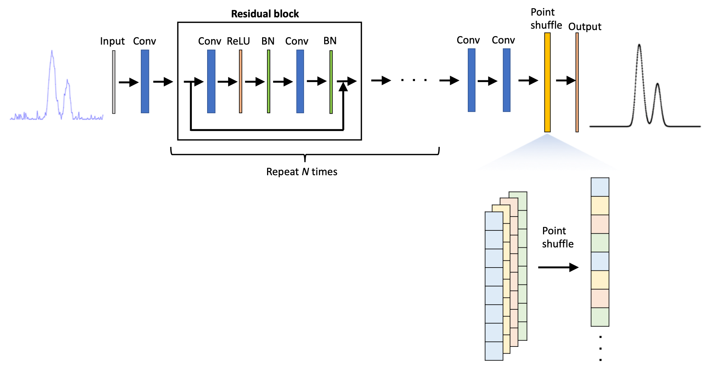

# About this repository  
  

Low-resolution and noisy 1D signals including Gaussian peaks (e.g., molecular spectra, [LiDAR](https://en.wikipedia.org/wiki/Lidar) histogram data, and other data) are denoised and up-sampled using a deep neural network model. 
The model is similar to the one proposed in [[1](https://opg.optica.org/ao/abstract.cfm?uri=ao-61-9-f15)] and based on a stack of residual blocks [[2](https://paperswithcode.com/method/residual-block#:~:text=Residual%20Blocks%20are%20skip%2Dconnection,part%20of%20the%20ResNet%20architecture.)] and a point-shuffle method inspired by pixel shuffle [[3](https://paperswithcode.com/method/pixelshuffle)].  
  
# Example
In the example below, signal including 128 data points is up-sampled to 512 and denoised at the same time.   
TO BE ADDED   
# Code
- `generate_data.py`: Synthetic dataset can be created by running this script. Low-resolution and noisy data and high-resolution and noise-less data are generated. The number of Gaussian peaks, the number of data points for high- and low-resolution data, peak widths, noise levels, and amplitudes can be set.
- `model.py`: A model is defined. 
- `loss.py`: A custom loss function is defined.
- `main.py`: This is a script for training and evaluating the model.
# Architecture 

# Reference
[[1](https://opg.optica.org/ao/abstract.cfm?uri=ao-61-9-f15)] Gangping Liu and Jun Ke, Full-waveform LiDAR echo decomposition based on dense and residual neural networks, Applied Optics, vol. 61, 9, pp. F15-F24, 2022  
[[2](https://paperswithcode.com/method/residual-block#:~:text=Residual%20Blocks%20are%20skip%2Dconnection,part%20of%20the%20ResNet%20architecture.)] Paper With Code, "Residual Block," paperswithcode.com. [Online]. Available: https://paperswithcode.com/method/residual-block#:~:text=Residual%20Blocks%20are%20skip%2Dconnection,part%20of%20the%20ResNet%20architecture. [Accessed: 31 May, 2024]  
[[3](https://paperswithcode.com/method/pixelshuffle)] Paper With Code, "Pixel Shuffle," paperswithcode.com. [Online]. Available: https://paperswithcode.com/method/pixelshuffle [Accessed: 31 May, 2024]

